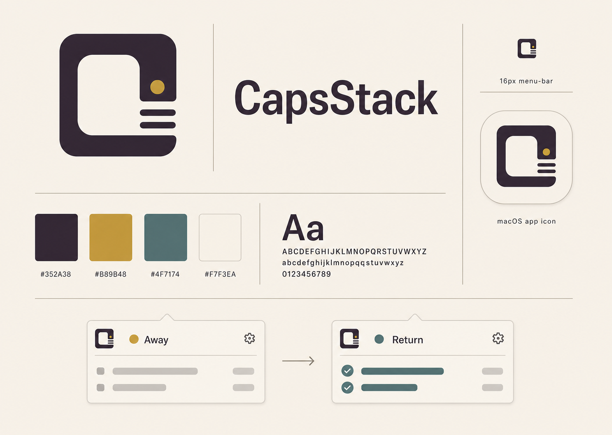

# CapsStack Brand Guide

Status: approved direction

## Brand idea

CapsStack is a quiet, well-made macOS utility that holds the thread of AI-assisted work while its user steps away. The identity should feel closer to a precision instrument, a bound notebook, or classic stationery than to a generic AI product.

The core promise is: set the switch, step away, and return without losing context.

## Mark

The approved mark is the rounded geometric C-shaped enclosure with:

- one fixed circular status indicator in the upper-right area;
- three short horizontal summary lines beneath it;
- a large open counter that keeps the symbol legible at menu-bar size.

The mark's geometry is locked. Do not redraw, rotate, skew, outline, add effects, move the status dot, or change the relationship between the enclosure and the three lines.

For the macOS menu bar, use the compact menu-bar mark. Keep the enclosure and summary lines monochrome so they follow the menu-bar appearance. Use the circular cutout as the phase indicator: system green while away, Petrol Slate while summarizing, system red on failure, and system gray while idle or disabled. The accessibility label must also include the current state.

## Color

| Token | Hex | Primary use |
| --- | --- | --- |
| Ink Aubergine | `#352A38` | Primary mark, wordmark, headings, dark foreground |
| Rice Paper | `#EFE7D8` | Warm brand canvas and large background areas |
| Aged Brass | `#B89B48` | Normal accent and the mark's status dot |
| Petrol Slate | `#4F7174` | Returned/completed accent |
| Bone | `#F7F3EA` | Raised native surfaces and light icon background |
| Brief Signal | `#C6F24E` | Dark UI selection and app-icon status accent |

Avoid blue-purple gradients, neon cyan, glossy effects, and large saturated color fields. Aged Brass and Petrol Slate are accents; Ink Aubergine and the warm neutrals should dominate.

The dark app-icon treatment is an intentional exception to the warm canvas: use a near-black charcoal tile, an off-white mark, and a larger saturated system-green dot with a charcoal keyline so it remains legible at Dock size. Keep the finish matte and the depth restrained.

State color must never be the only signal. Pair it with an icon, label, or status text.

## Typography

Use native macOS system typography inside the app. Prefer compact, sturdy weights and calm spacing over futuristic or monospaced styling.

The wordmark shown on the board is a visual target, not a named production font. Before release, reproduce it as a reviewed vector lockup rather than approximating it with a runtime font.

## Product application

- Keep the app mostly native and neutral; use brand colors only for identity and state emphasis.
- Use Aged Brass for normal/ready moments.
- Use system green for the menu-bar away indicator.
- Use Petrol Slate for successful return and completed summaries.
- Preserve macOS semantic colors for destructive actions, warnings, and errors.
- Prefer spacing, alignment, and thin separators to decorative cards or heavy shadows.
- Keep surfaces warm and quiet; the product should feel like a dependable tool, not an AI dashboard.

## Asset status

`capsstack-brand-board.png` is the approved visual reference. The production app-icon master lives beside it, with packaged exports under `Packaging/` and runtime images under `Sources/CapsStack/Resources/`. The compact menu-bar mark is shipped separately so its status dot can change color without altering the app icon.
